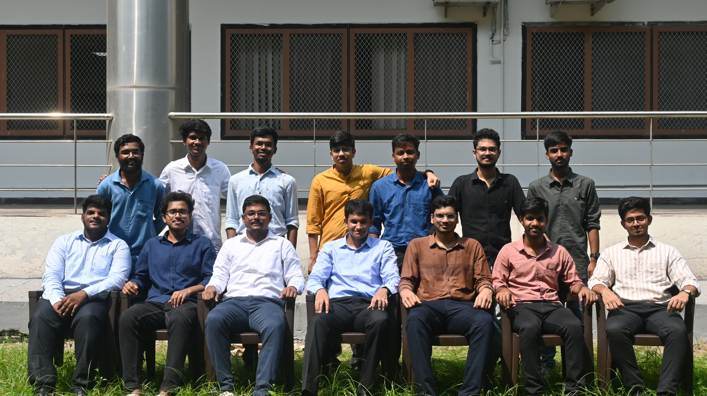
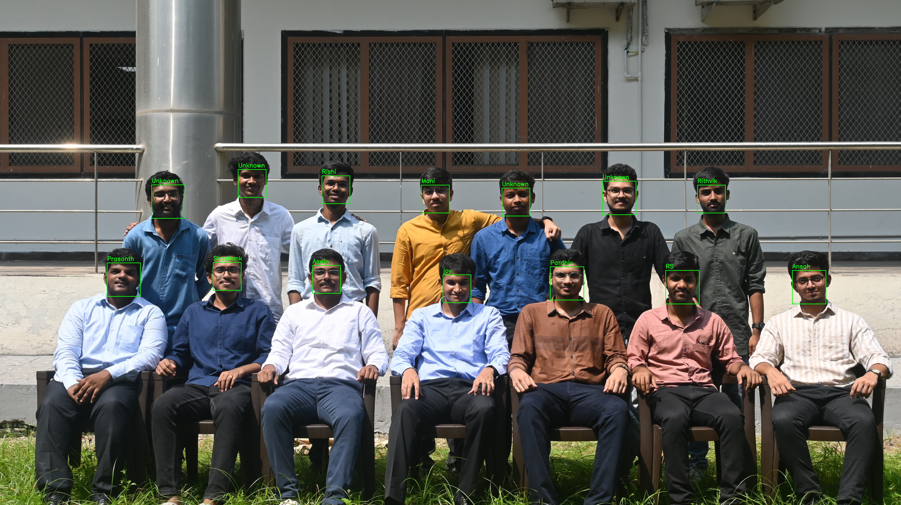

# Smart Attendance System Using Deep Learning

## Table of Contents

- [Youtube Presentation](#youtubepresentation)

- [Introduction](#introduction)

- [Features](#features)

- [Workflow](#workflow)

- [System Components](#systemcomponents)

- [Prerequisites](#prerequisites)

- [Installation](#installation)

- [Sample Run](#samplerun)

## Youtube Presentation

- Open the following Link for Video Demonstration and Explanation of Face Recognition in Classroom Setup (https://www.youtube.com/watch?v=6uwMNi5FwPk)

## Introduction
-  Face recognition has established itself as a critical application in image processing and is widely utilized in various technical fields. Its significance is particularly evident in tasks involving authentication, such as managing student attendance in educational institutions. Traditional methods of taking attendance, which involve calling out names and recording data manually, are both labor-intensive and prone to errors.
-  This project implements a smart attendance system that identifies individuals from a dataset of known faces using a combination of Haar Cascade for face detection and a Siamese Neural Network for face recognition. The system is capable of recognizing known faces and labeling them, providing an efficient solution for automated attendance management.

## Features

#### Face Detection:
- Utilizes Haar Cascade Classifier to detect faces in images or video streams.
  
#### Face Recognition: 
- Leverages a Siamese Neural Network to compute similarities between face embeddings and identify individuals.

#### High Accuracy: 
- Employs advanced techniques like face embeddings and deep learning for reliable performance.
  
#### Dataset Compatibility:
- Works with structured datasets where each individual has multiple images in a labeled directory.
  
## Workflow

#### Dataset Preparation
- Organize the dataset into directories for each individual. For example:

dataset/

    Joy_id1/
    
        image1.jpg
        
        image2.jpg
        
        ...
        
    Aswin_id2/
    
        image1.jpg
        
        image2.jpg
        
        ...
        
#### Face Embeddings Generation
- Extract embeddings for each image in the dataset using a pre-trained model (e.g., RetinaFace). These embeddings are saved as .npy files for further processing.

#### Training the Siamese Network
- The Siamese Neural Network is trained on pairs of embeddings, learning to predict whether two embeddings belong to the same person.

#### Face Recognition

- Detect faces in the input image using Haar Cascade Classifier.
- Compute embeddings for detected faces.
- Compare embeddings with the known dataset using the trained Siamese Network.
- Label recognized faces and mark unrecognized faces as "Unknown."

## System Components

#### 1. Generate Embeddings
- Script: generate_embeddings.py
- Extracts face embeddings from the dataset using the extract_face_embeddings function.
- Saves the embeddings and labels as embeddings.npy and labels.npy respectively.
- Usage:
python generate_embeddings.py

#### 2. Train Siamese Network
- Script: train_siamese.py

- Trains a Siamese Neural Network on the generated embeddings and labels.
- Saves the trained model as siamese_model.h5.
- Usage:
python train_siamese.py

#### 3. Face Recognition
- Script: recognize_face.py
- Recognizes faces in a given input image.
- Labels detected faces with their names or marks them as "Unknown".
- Usage:
python recognize_face.py

## Prerequisites 

- Python 3.x
- TensorFlow / Keras
- OpenCV
- NumPy
- HaarCascade_Classifier.xml (https://github.com/opencv/opencv/blob/master/data/haarcascades/haarcascade_frontalface_default.xml)

## Installation

#### Clone the repository:

- git clone https://github.com/your-repo/smart-attendance-system.git

#### Install the required dependencies:
pip install -r requirements.txt

 #### Prepare the dataset:

- Create a folder named dataset.
  
- Add subfolders for each individual containing their images.
  
#### Generate embeddings and labels:

- python generate_embeddings.py
  
#### Train the Siamese Neural Network:

- python train_siamese.py
  
#### Run face recognition:

- python recognize_face.py

## Sample Run

#### Input:

#### Output: 

